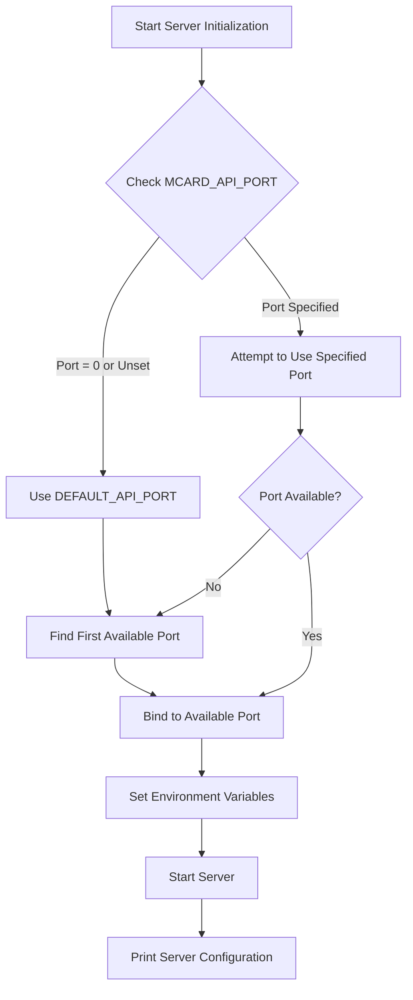

# MCard JavaScript Bridge

## Overview

This module provides a robust bridge between Python's MCard backend and JavaScript clients, enabling seamless integration and communication across different runtime environments.

## Key Design Principles

### Dynamic Port Management

The JavaScript bridge implements a sophisticated dynamic port management system to ensure flexible and conflict-free server startup:

1. **Port Source Hierarchy**:
   - Primary source: Environment variable `MCARD_API_PORT`
   - Fallback: `DEFAULT_API_PORT` (5320) from `mcard/config_constants.py`
   - Automatic port discovery if primary sources are unavailable

2. **Port Selection Strategy**:
   - Attempt to use specified port
   - If port is unavailable or set to 0, dynamically find an open port
   - Systematically search for available ports starting from the default

### Server Startup Workflow



### Key Components

- **`server.py`**: Python FastAPI server with dynamic port management
- **`mcard_service_proxy.js`**: JavaScript proxy for server communication
- **`test_server_startup.js`**: Startup and connection test script

## Environment Configuration

### Required Environment Variables

- `MCARD_API_PORT`: Preferred server port (optional)
- `MCARD_SERVER_HOST`: Server host address (default: localhost)
- `MCARD_API_KEY`: Authentication key for server access

## Startup Process

1. Server attempts to use specified or default port
2. Dynamically finds an available port if needed
3. Sets `PORT` and `MCARD_API_PORT` environment variables
4. Prints server configuration
5. Starts Uvicorn server

## Error Handling

- Graceful port conflict resolution
- Comprehensive logging
- Maximum startup attempt limit (5 attempts)

## Performance Considerations

- Minimal overhead in port selection
- Systematic port search algorithm
- Configurable startup timeout

## Debugging

Enable verbose logging by setting:
```bash
export MCARD_SERVICE_LOG_LEVEL=DEBUG
```

## Security

- Avoids hardcoded ports
- Environment-driven configuration
- Supports custom host and port settings

## Compatibility

- Python 3.8+
- Node.js 14+
- FastAPI
- Uvicorn

## Migration from `client.js` to `mcard_service_proxy.js`

We have completely transitioned from the previous `client.js` implementation to a more robust and feature-rich `mcard_service_proxy.js`. This new implementation offers:

- **Singleton Pattern**: Ensures a single, consistent instance of the MCard service
- **Enhanced Server Management**: 
  - Improved server startup and shutdown mechanisms
  - Dynamic port selection
  - Comprehensive error handling
- **Robust Configuration**: 
  - Validation for API keys, ports, and database paths
  - Flexible configuration options

## Test Coverage

We have developed a comprehensive test suite for `mcard_service_proxy.js` that covers:

1. **Content Operations Tests**:
   - Creating cards with various content types
     - Plain text
     - JSON
     - XML
     - Binary formats (PDF, SVG, JPG, PNG)
   - Handling large and edge case content
   - Base64 encoded content support

2. **Validation Tests**:
   - API key validation
   - Port number validation
   - Database path validation
   - Network connectivity checks

3. **Persistent Database Tests**:
   - Database file creation
   - Persistent card storage across test runs
   - Database file inspection

## Potential Improvements

- [ ] Add more granular port range configuration
- [ ] Implement advanced port allocation strategies
- [ ] Create more comprehensive startup failure diagnostics

## Contributing

Please read our [CONTRIBUTING.md](../CONTRIBUTING.md) for details on our code of conduct and the process for submitting pull requests.

## License

This project is licensed under the MIT License - see the [LICENSE.md](../LICENSE.md) file for details.
